# 台灣坡地位移偵測

本專案使用台灣 GNSS 觀測時間序列，分析不同地區的坡地位移，並比較機器學習與深度學習模型對東向（E）、北向（N）及高程（H）位移的預測能力。

> **資料隱私提醒**：本 repo 不提供原始 GNSS 資料、處理後 CSV、模型 checkpoint 或 TensorBoard 訓練紀錄。發布前請確認資料來源的使用權限，並檢查 notebook 輸出與結果圖片是否包含敏感資訊。

## 目錄

- [專案目的](#專案目的)
- [專案結構](#專案結構)
- [使用方法](#使用方法)
- [環境安裝](#環境安裝)
- [資料準備](#資料準備)
- [執行方式](#執行方式)
- [資料前處理](#資料前處理)
- [實驗結果與分析](#實驗結果與分析)
- [重現性與隱私](#重現性與隱私)
- [授權](#授權)

## 專案目的

GNSS 觀測資料可用來追蹤地表位置隨時間的變化。本專案將觀測資料整理成時間序列，透過不同模型預測位移變化，作為坡地監測與模型比較的研究練習。

目前使用的主要欄位包括：

| 欄位 | 說明 |
| --- | --- |
| `date_time` | 觀測時間 |
| `E` | 東向位置或位移相關數值 |
| `N` | 北向位置或位移相關數值 |
| `H` | 高程位置或位移相關數值 |
| `EMove` | 東向位移目標 |
| `NMove` | 北向位移目標 |
| `HMove` | 高程位移目標 |

完整欄位與資料結構請參考 [Data/README_Dataset.md](Data/README_Dataset.md)。實際單位與欄位定義仍應以資料提供者的文件為準。

## 專案結構

```text
.
├── DataHandle.ipynb                 # 資料清理、探索與縮放
├── RandomForest.ipynb               # 傳統機器學習實驗
├── XGBoost.ipynb                    # XGBoost 實驗
├── GRU.ipynb                        # GRU 實驗
├── TemperalFusionTransformer.ipynb  # Temporal Fusion Transformer 實驗
├── DL/
│   ├── data_loader.py               # PyTorch 資料載入器
│   └── main.ipynb                   # 其他深度學習流程
├── Data/
│   ├── README_Dataset.md             # 資料格式說明
│   └── <本機私有資料>                # 不納入 Git
├── img/                              # 可公開的結果圖片
└── LICENSE
```

## 使用方法

本專案比較以下模型：

- **Random Forest**：傳統集成式機器學習模型。
- **XGBoost**：梯度提升式樹模型。
- **GRU**：適合處理時間序列的循環神經網路。
- **Temporal Fusion Transformer（TFT）**：用於時間序列預測的注意力模型。

流程如下：

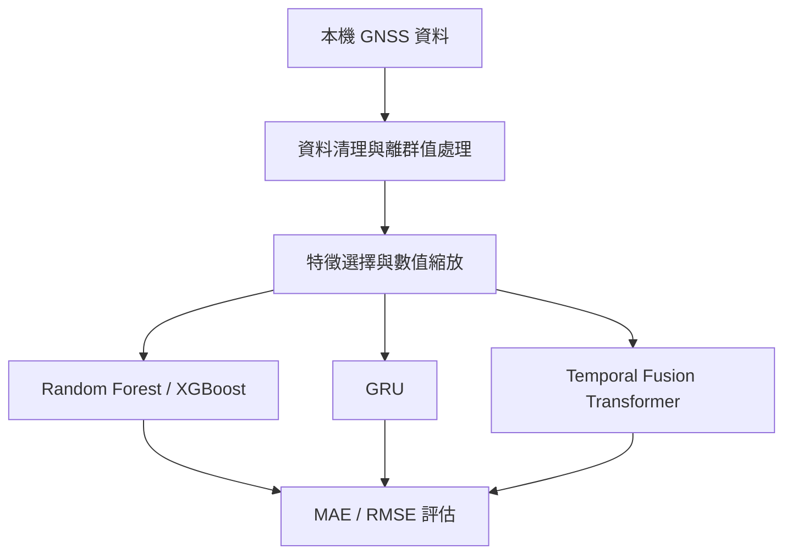

## 環境安裝

建議使用 Python 3.10 以上版本：

```powershell
python -m venv .venv
.\.venv\Scripts\Activate.ps1
python -m pip install --upgrade pip
pip install jupyter pandas numpy matplotlib seaborn scikit-learn xgboost torch lightning pytorch-forecasting tensorboard
```

若使用 NVIDIA GPU，PyTorch 的安裝指令可能依 CUDA 版本不同，請依 [PyTorch 官方安裝選擇器](https://pytorch.org/get-started/locally/)選擇適合的版本。

## 資料準備

請將獲得授權的資料放在本機 `Data/` 目錄，結構例如：

```text
Data/
├── Kaohsiung/
│   ├── g2.csv
│   ├── g3.csv
│   └── g4.csv
├── Nantou/
│   ├── cn01.csv
│   ├── cn02.csv
│   └── cn04.csv
└── Taipei/
    ├── h23-g1.csv
    ├── h23-g2.csv
    └── rain.csv
```

目前 notebook 主要示範以下資料：

- 高雄：`g2`
- 南投：`cn01`
- 台北：`h23-g1`

原始資料與處理後的 CSV 已由 `.gitignore` 排除，不應提交到 GitHub。

## 執行方式

1. 從 repository 根目錄開啟 VS Code 或 Jupyter。
2. 將有權限使用的資料放入本機 `Data/` 目錄。
3. 執行 `DataHandle.ipynb`，完成資料檢查、清理與縮放。
4. 依序執行 `RandomForest.ipynb`、`XGBoost.ipynb`、`GRU.ipynb` 或 `TemperalFusionTransformer.ipynb`。
5. 執行 `DL/main.ipynb` 時，請從 repository 根目錄開啟，以確保相對匯入路徑正確。

多數 notebook 使用相對路徑，例如 `Data/Taipei/h23-g1_scaled.csv`。如果執行位置不同，請調整資料路徑。

## 資料前處理

目前流程包含：

1. 選擇特徵欄位與預測目標。
2. 解析 `date_time` 並檢查遺失值。
3. 移除超過三個標準差的離群值。
4. 使用 `MinMaxScaler` 對選定的數值欄位進行縮放。
5. 將時間序列分成訓練、驗證與測試資料。
6. 使用 MAE 與 RMSE 評估預測結果。

## 實驗結果與分析

### 如何解讀

以下圖片呈現實際位移與模型預測的比較，以及各目標方向的評估結果。一般而言：

- 預測線越貼近實際線，代表模型越能捕捉該段時間序列的變化。
- 在快速變化、局部尖峰或轉折處出現較大落差，表示模型對突發變化的掌握仍有限。
- MAE 反映平均絕對誤差；RMSE 對較大的預測誤差更敏感，適合一起觀察。
- 不同地區的資料特性不同，因此不應只用單一地區的結果宣稱某個模型一定較好。

圖片是目前實驗的視覺化結果；完整參數、資料切分與數值輸出請以各 notebook 的執行結果為準。由於公開 repo 不包含原始資料與訓練紀錄，這些結果目前應視為本研究的實驗紀錄，而非跨資料集的正式基準。

### 台北：h23-g1

#### 各模型的位移比較

**GRU**

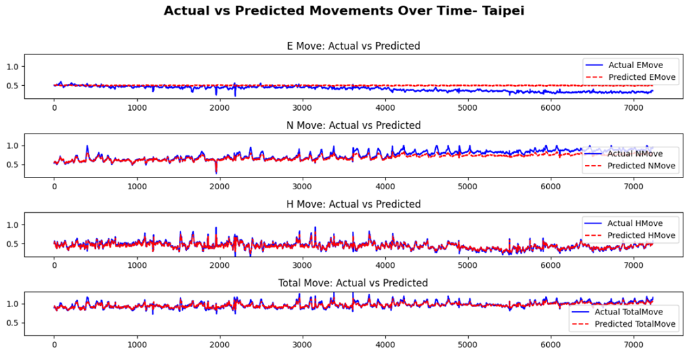

**XGBoost**

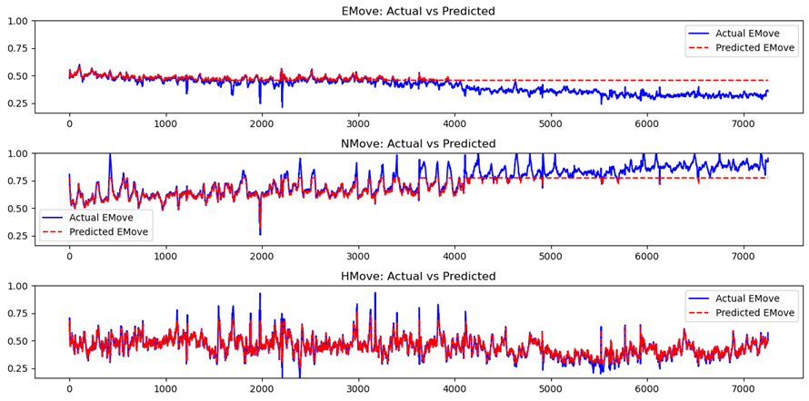

**TFT**

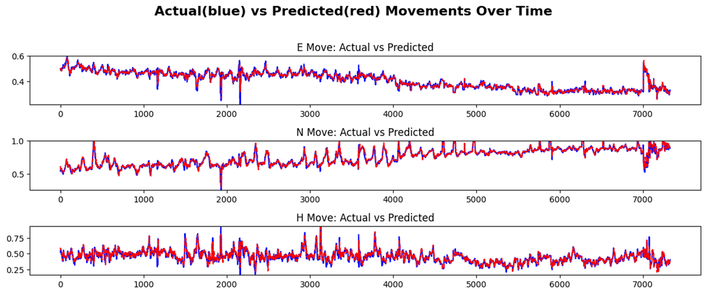

#### 各方向評估結果

| 方向 | 評估圖 |
| --- | --- |
| EMove | 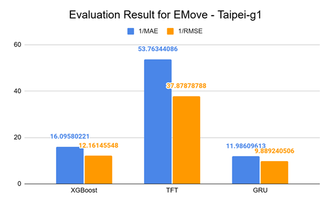 |
| NMove | 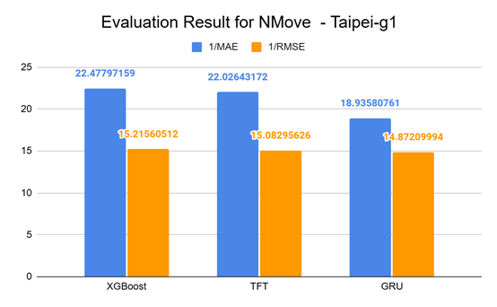 |
| HMove | 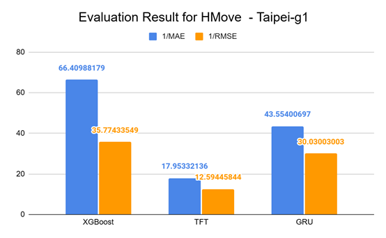 |

### 南投：cn01

#### 各模型的位移比較

**GRU**

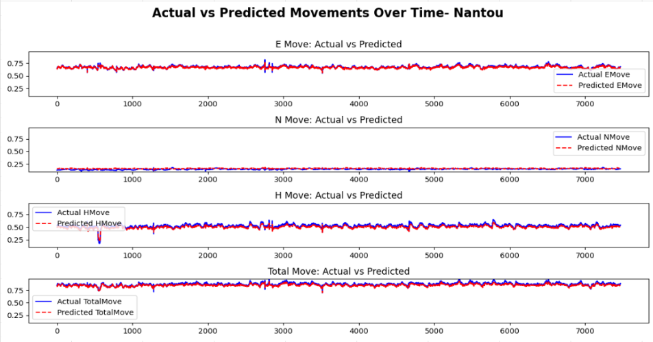

**XGBoost**

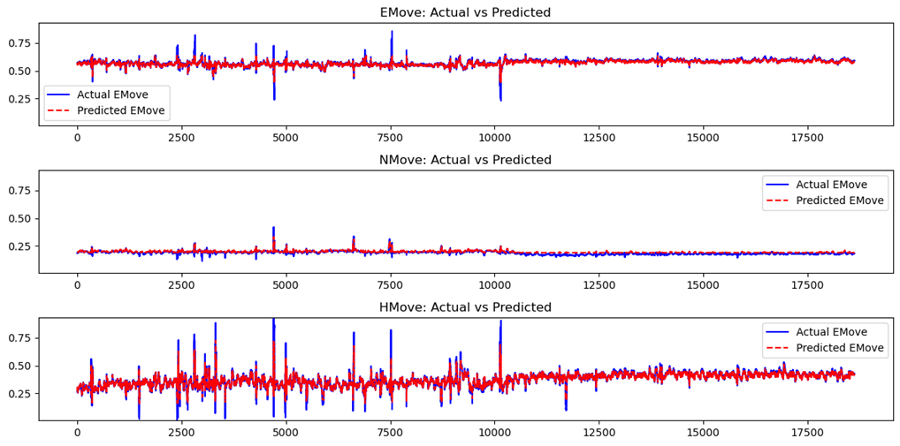

**TFT**

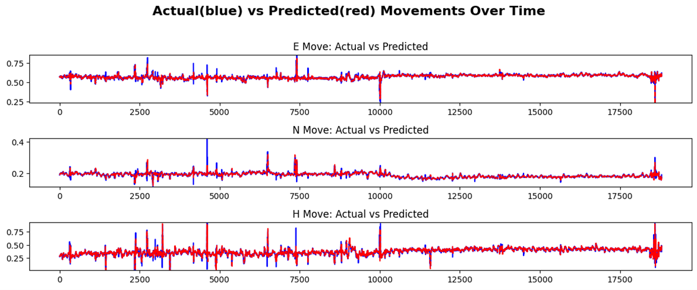

#### 各方向評估結果

| 方向 | 評估圖 |
| --- | --- |
| EMove | 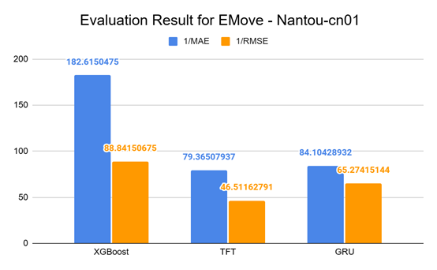 |
| NMove | 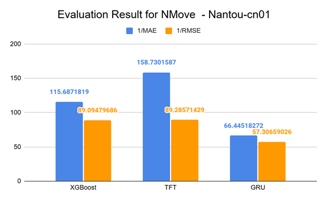 |
| HMove | 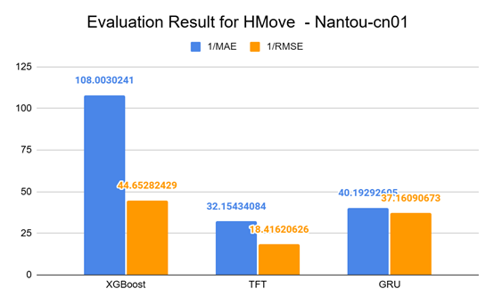 |

### 高雄：g2

#### 各模型的位移比較

**GRU**

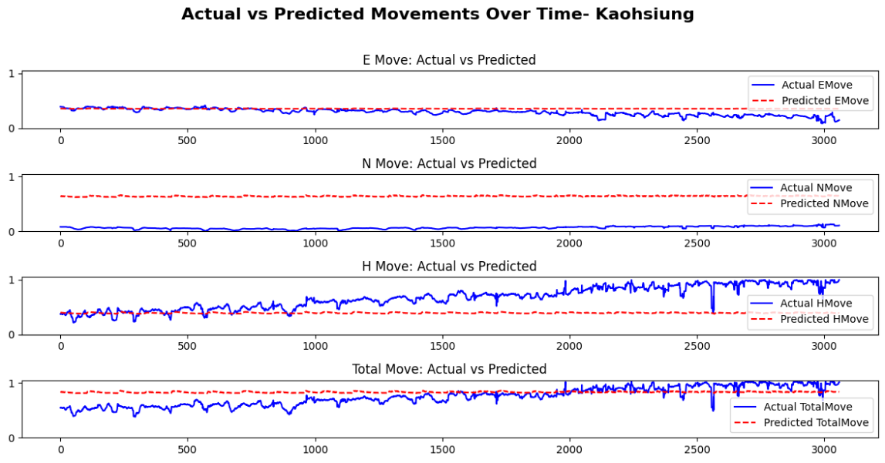

**XGBoost**

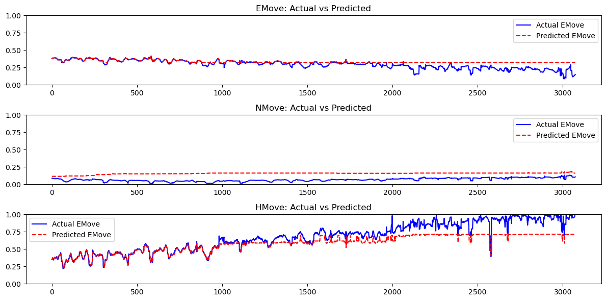

**TFT**

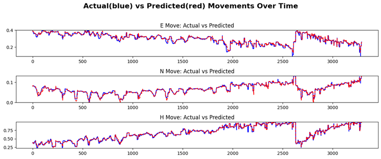

#### 各方向評估結果

| 方向 | 評估圖 |
| --- | --- |
| EMove | 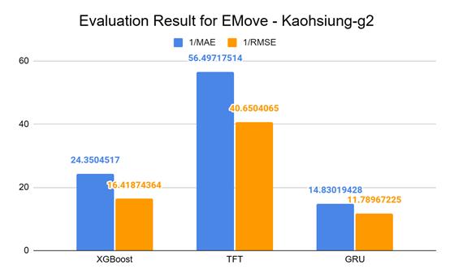 |
| NMove | 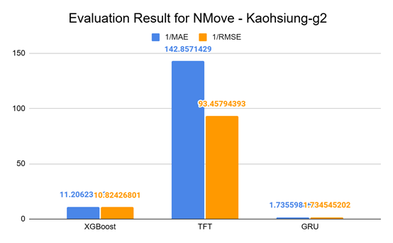 |
| HMove | 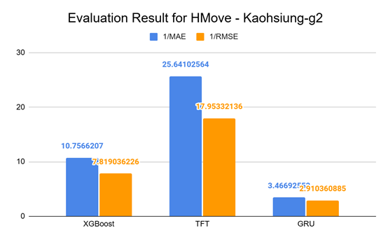 |

## 重現性與隱私

- 不要提交原始或處理後資料、測站識別資訊、個人資訊、帳號密碼、checkpoint 或 `lightning_logs/`。
- 發布前清除 notebook 輸出，特別是原始資料列、完整檔案路徑與錯誤訊息。
- 結果圖片仍可能暴露資料的時間範圍、變化特徵或測站資訊，發布前請再次審查。
- 使用 `git status` 與 `git diff --cached --stat` 檢查即將提交的內容。
- 實驗結果可能受到套件版本、亂數種子、硬體與資料切分方式影響。

## 授權

本專案採用 MIT License，詳見 [LICENSE](LICENSE)。資料的使用權與授權不一定隨程式碼授權，請另外確認資料提供者的規範。